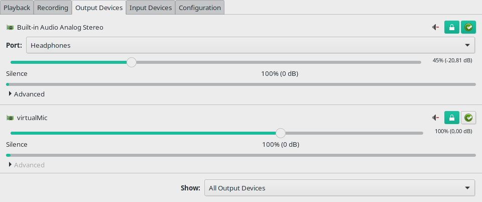
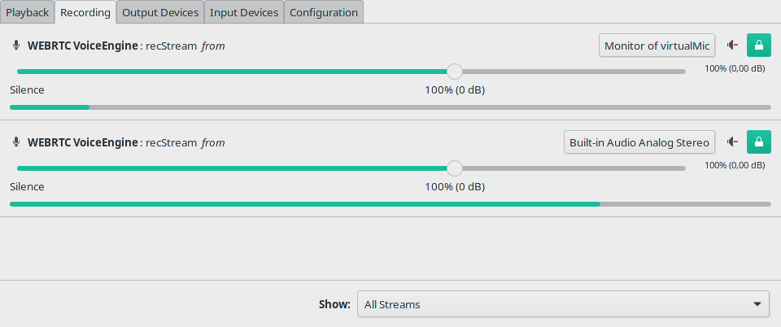
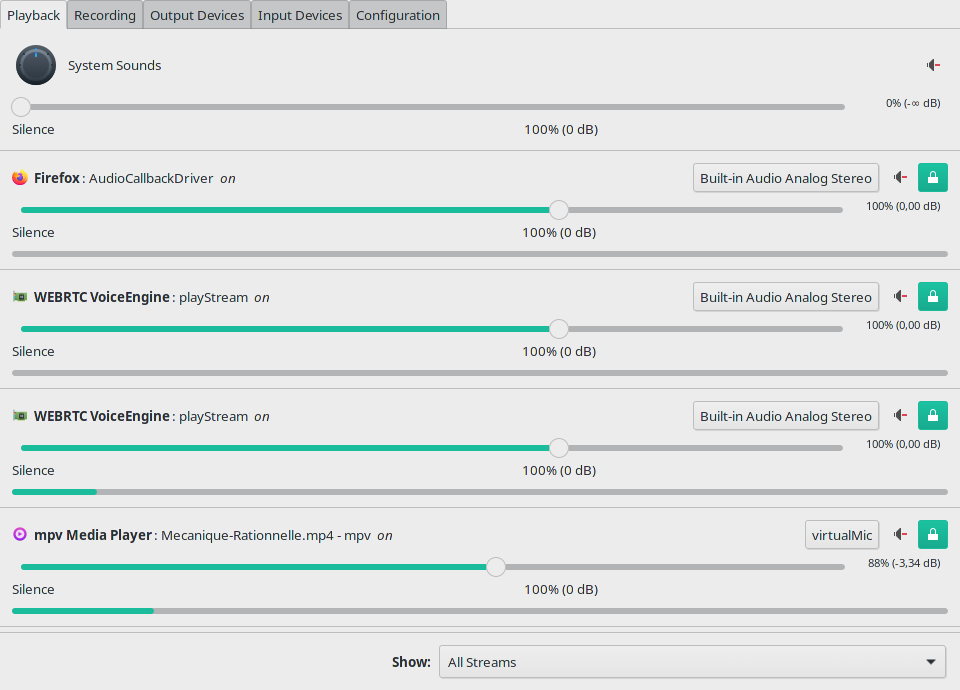
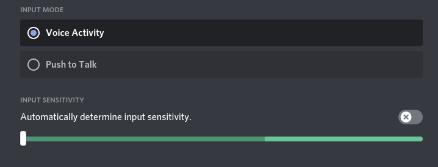
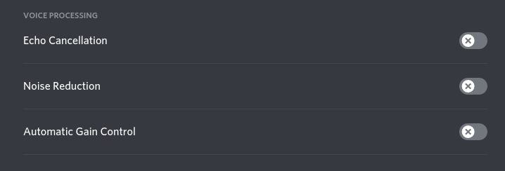
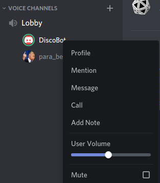

# DiscoBot: a Discord user only for music
How can you create a fully-control discord user in a separate instance, just to play music during your games?

## Open two instances of the Discord app at the same time
Opening a second instance in a web browser is not enough as it does not offer the settings.

[This article](https://technex.us/2020/06/running_multiple_instances_of_discord_in_linux/) explains how to open a second instance of Discord.
```
/bin/bash -c "export XDG_CONFIG_HOME=~/.discord_bot; export TMPDIR=~/discord_bot; /usr/bin/discord"
```

Log in with a second account and set it aside for the moment.

## Create a virtual sink to redirect music
The procedure is much simpler than merging channels.
One virtual sink is enough:
```
pactl load-module module-null-sink sink_name=virtualMic sink_properties=device.description=virtualMic
```

## Manage the redirections in PulseAudio Control Pannel
1. Make sure the `virtualMic` output is **unmuted**.


2. Make the Discord music user record from the virtual sink.


3. Redirect the ouput of your music to the virtual sink.


## Set the Discord voice and audio parameters.
1. Set the input mode to `Voice Activity`, slide the sentivity to the minimum and disable `Automatically determine input sensitivity`.


2. Disable all `Voice Processing` features.


3. Each individual user can now manage the music volume to its liking, but you're still in charge of the ambiance.


